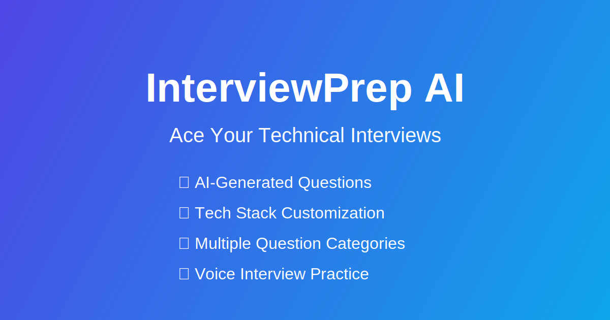

# InterviewPrep AI 🚀

An intelligent interview preparation platform powered by AI to help job seekers practice and ace their technical interviews.

## 🌟 Features

- **AI-Generated Interview Questions**: Generate realistic interview questions based on job role, experience level, and tech stack
- **Multiple Question Categories**: Technical, behavioral, critical thinking, and leadership questions
- **Experience Level Targeting**: Tailor questions to different career stages (entry-level to manager)
- **Tech Stack Customization**: Specify technologies relevant to your job search
- **Voice Interview Practice**: Practice answering interview questions verbally with our intelligent voice assistant
- **Question Management**: Save, organize, and review your practice questions
- **Responsive Design**: Seamless experience across desktop and mobile devices
- **Dark Mode Support**: Comfortable UI for day and night use

## 💻 Tech Stack

- **Frontend**: Next.js 15, React 19, TypeScript
- **UI Components**: Radix UI, Tailwind CSS 4
- **Deployment**: Vercel
- **Authentication**: Firebase Authentication
- **Database**: Firebase Firestore
- **AI Integration**: Google Gemini via AI SDK
- **Voice Features**: Vapi AI Web SDK
- **Analytics**: Vercel Analytics

## 🚀 Getting Started

### Live Demo

Check out the live application: [InterviewPrep AI](https://prep-interview-vapi.vercel.app/)

## 🛠️ API Integration

### Google Gemini API

1. Obtain a Google Gemini API key from [Google AI Studio](https://ai.google.dev/)
2. Add your API key in the dashboard's API keys section to enable AI question generation

### Voice Integration

Voice practice capabilities are fully implemented using the Vapi AI Web SDK:
1. Get your Vapi API key from [Vapi.ai](https://vapi.ai/)
2. Add your API key in the settings section to enable voice interview practice
3. Practice answering interview questions verbally with our intelligent voice assistant

## 🔒 Authentication

This project uses Firebase Authentication with the following providers:
- Google Sign-In

